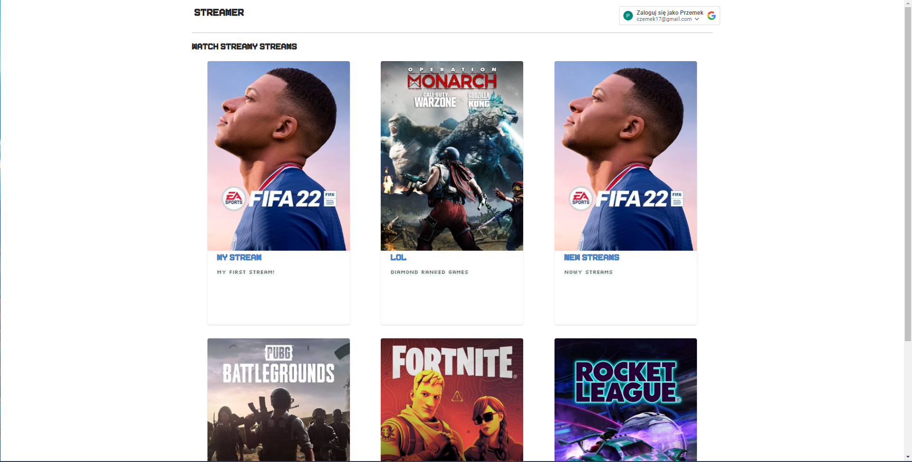
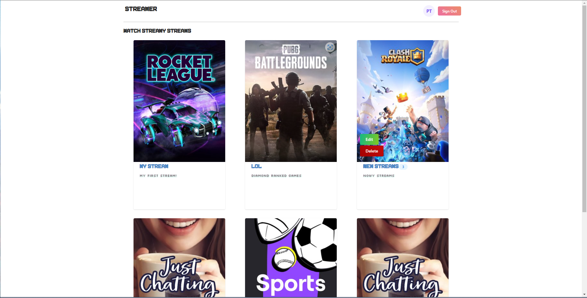
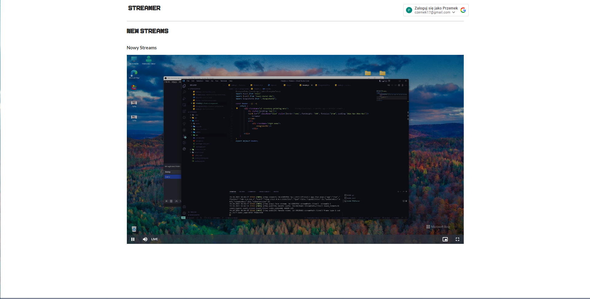

# Strams
Simple streaming app

## Features

- sing in with google
- watch stream
- add steam
- edit stream
- delete stream

## Tech Stack

**Client:** React
**Server:** JSON Server, RTMP Server

## Installation
1. Run 'install.sh' to install components
2. Run 'run.sh' to start app.

## Screenshots

